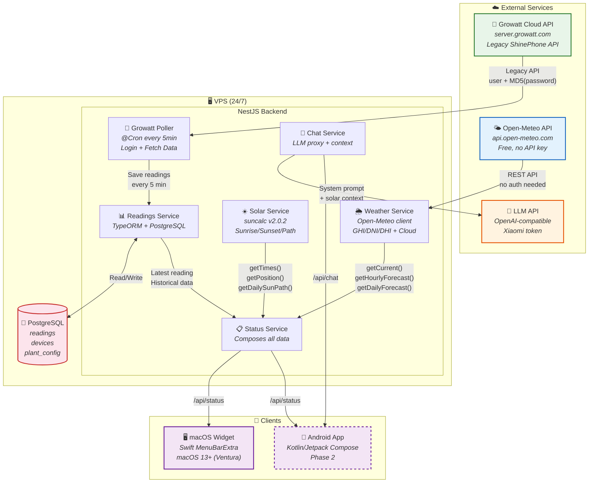
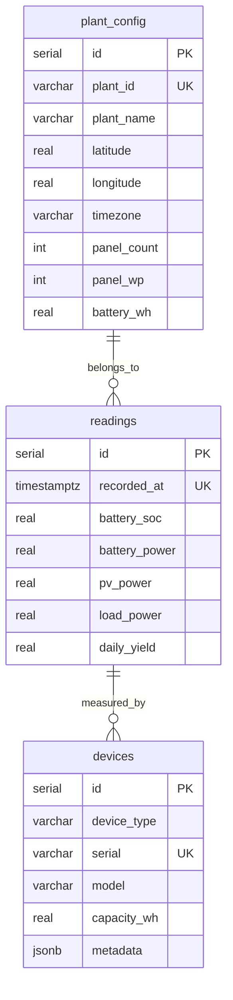
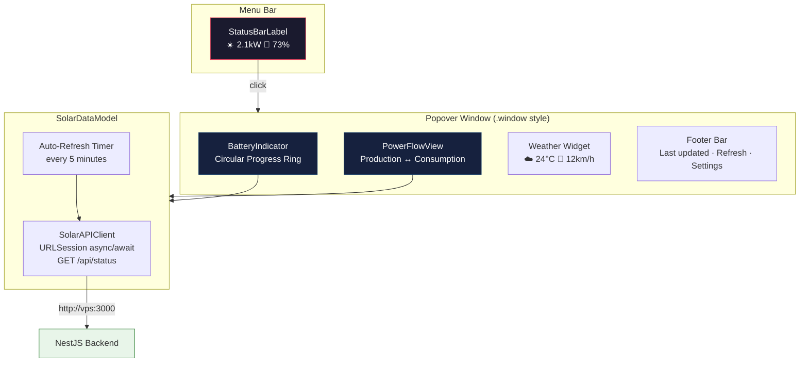
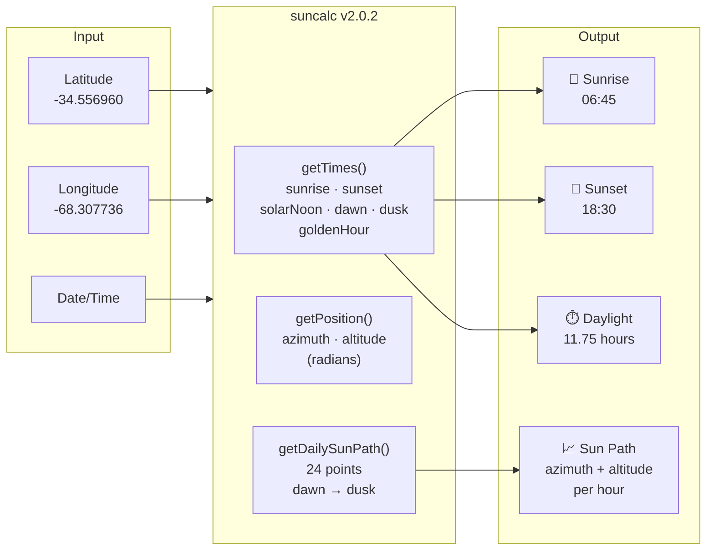
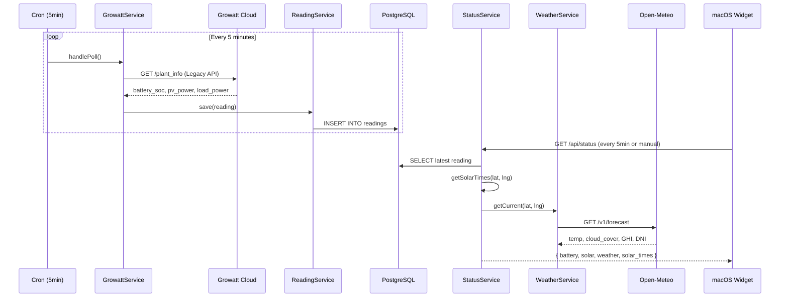
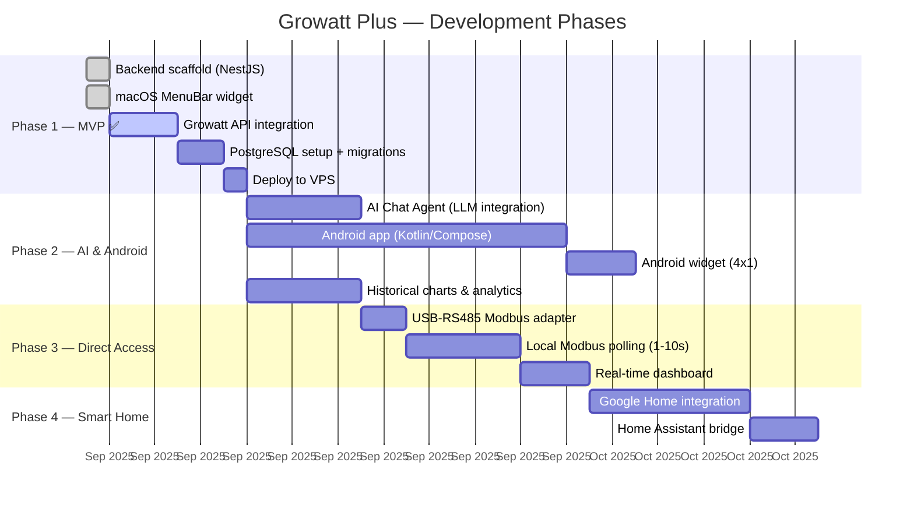
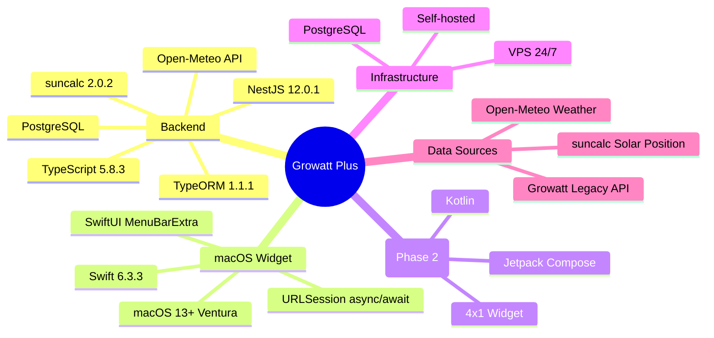

# Growatt Plus — Architecture

## System Overview

## API Endpoints

```mermaid
graph LR
    subgraph REST API
        direction TB
        H["GET /api/health"]
        S["GET /api/status"]
        R["GET /api/readings"]
        D["GET /api/devices"]
        ST["GET /api/solar/today"]
        SP["GET /api/solar/path?date="]
        WC["GET /api/weather/current"]
        WF["GET /api/weather/forecast"]
        CH["POST /api/chat"]
        SW["GET /api/docs<br/><i>Swagger UI</i>"]
    end

    style H fill:#c8e6c9
    style S fill:#c8e6c9
    style R fill:#c8e6c9
    style D fill:#c8e6c9
    style ST fill:#fff9c4
    style SP fill:#fff9c4
    style WC fill:#bbdefb
    style WF fill:#bbdefb
    style CH fill:#ffe0b2
    style SW fill:#e1bee7
```

## Database Schema

## macOS Widget Architecture

## Solar Position Calculations (suncalc)

## Data Flow — Polling Cycle

## Phased Roadmap

## Tech Stack Summary

